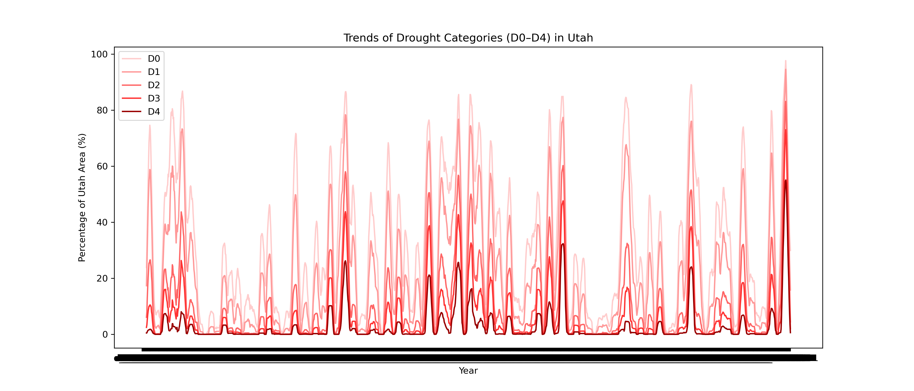
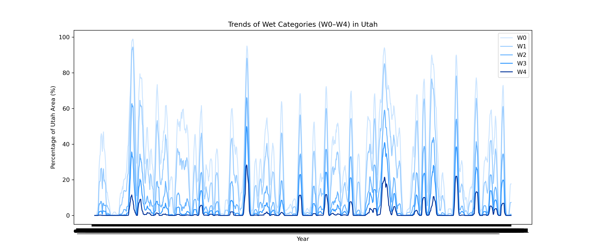
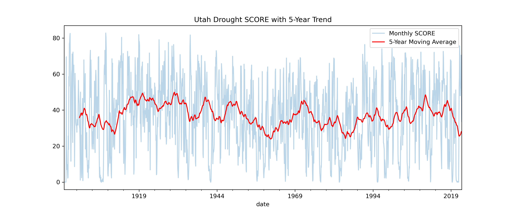
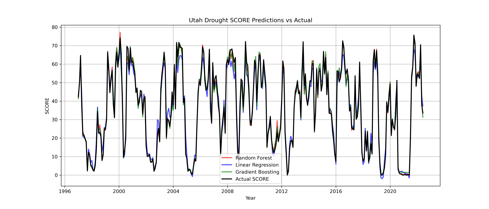

# Utah Drought Analysis Using Machine Learning

This project analyzes **drought and wet conditions in Utah** using historical data and applies **machine learning models** to predict the Utah Drought Severity SCORE. 
The goal is to understand trends over time and evaluate model predictions.

## Dataset
The dataset contains monthly observations of drought and wet categories in Utah from 1895 onward. Key columns include:

- **SCORE** – Utah Drought Severity Score  
- **DATE** – Observation date (YYYYMMDD format)  
- **D0–D4** – Percentage of Utah area in drought categories (D0 = abnormally dry to D4 = exceptional drought)  
- **W0–W4** – Percentage of Utah area in wet categories (W0 = abnormally wet to W4 = extremely wet)  
- **SCORE_MA60** – 5-year moving average of SCORE 

## Visualizations   Plotting Drought and Wet Categories
import matplotlib.pyplot as plt

# -------------------------------
# Plot Drought Categories (D0–D4)
# -------------------------------
plt.figure(figsize=(14,6))
colors_d = ['#ffcccc','#ff9999','#ff6666','#ff3333','#990000']  # light to dark red
drought_cols = ['D0','D1','D2','D3','D4']

for i, col in enumerate(drought_cols):
    plt.plot(data.index, data[col], label=col, color=colors_d[i], linewidth=2)

plt.title("Trends of Drought Categories (D0–D4) in Utah")
plt.xlabel("Year")
plt.ylabel("Percentage of Utah Area (%)")
plt.legend(title="Drought Level")
plt.grid(True)
plt.show()  

plt.figure(figsize=(14,6))
colors_w = ['#cce5ff','#99ccff','#66b3ff','#3399ff','#003399']  # light to dark blue
wet_cols = ['W0','W1','W2','W3','W4']

for i, col in enumerate(wet_cols):
    plt.plot(data.index, data[col], label=col, color=colors_w[i], linewidth=2)

plt.title("Trends of Wet Categories (W0–W4) in Utah")
plt.xlabel("Year")
plt.ylabel("Percentage of Utah Area (%)")
plt.legend(title="Wet Level")
plt.grid(True)
plt.show()  # Display the figure

### Drought Categories (D0–D4)

  
*Shows trends of different drought levels in Utah over time.*

### Wet Categories (W0–W4)

  
*Shows trends of wet conditions in Utah over time.*
# 5-year moving average to see long-term trend
data['SCORE_MA60'] = data['SCORE'].rolling(60).mean()  # 60 months = 5 years

data['SCORE'].plot(alpha=0.3, figsize=(12,5), label='Monthly SCORE')
data['SCORE_MA60'].plot(color='red', label='5-Year Moving Average')
plt.title("Utah Drought SCORE with 5-Year Trend")
plt.legend()
plt.show()

###Score trend
  
*Shows trends of score in Utah over time.*
#Models Traning
from sklearn.model_selection import train_test_split

X_train, X_test, y_train, y_test = train_test_split(X, y, test_size=0.2, shuffle=False)
from sklearn.ensemble import RandomForestRegressor, GradientBoostingRegressor
from sklearn.linear_model import LinearRegression

# Initialize models
rf = RandomForestRegressor(n_estimators=100, random_state=42)
gbr = GradientBoostingRegressor(n_estimators=100, random_state=42)
lr = LinearRegression()

# Train models
rf.fit(X_train, y_train)
gbr.fit(X_train, y_train)
lr.fit(X_train, y_train)
### Model Predictions vs Actual SCORE

plt.figure(figsize=(14,6))
plt.plot(y_test.index, rf.predict(X_test), label='Random Forest', color='red', alpha=0.7)
plt.plot(y_test.index, lr.predict(X_test), label='Linear Regression', color='blue', alpha=0.7)
plt.plot(y_test.index, gbr.predict(X_test), label='Gradient Boosting', color='green', alpha=0.7)
plt.plot(y_test.index, y_test, label='Actual SCORE', color='black', linewidth=2)
plt.title("Utah Drought SCORE Predictions vs Actual")
plt.xlabel("Year")
plt.ylabel("SCORE")
plt.legend()
plt.show()

  
*Comparison of predicted Utah Drought SCORE using Random Forest, Linear Regression, and Gradient Boosting models against actual values.*

---

## Machine Learning Models

Three models were used to predict the Utah Drought SCORE:

1. **Random Forest Regressor**  
2. **Linear Regression**  
3. **Gradient Boosting Regressor**

The models were trained on **80% of the data** (chronologically) and tested on the remaining 20%.  
